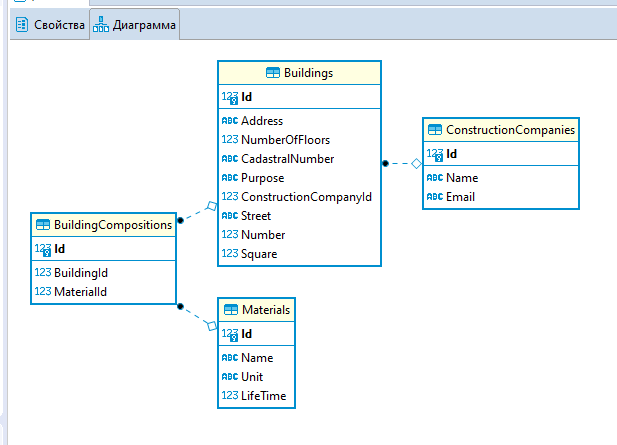

# Homework3
ДЗ по EF

Пояснение. 
Всего у меня в проекте 4 модели, соответветственно для них должны были быть разработаны DTO, маппинги, репозитозитории и сервисы и тп. 
Но я реализовал это только для модели Building и ContructionCompany, так как эти сущности связаны между собой, то я хотел сделать сразу факультативное задание, чтобы корректно 
можно было добавлять/апдейтить и тп записи Building, а потом реализовать остальные 2 модели. Но я что-то запутлся с реализацией факультатива и не получилось это сделать в рамках данного решения. 
Запросы впринципе работают, но в Building не добавляется ID для ContructionCompany, вместо этого я просто допускаю NULL.
